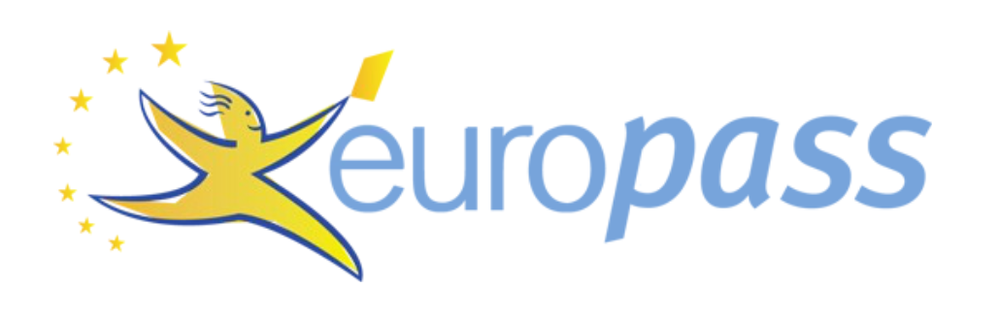

:dr: #1b428f
:br: #77a4db

[cols="2,4"]
|===
a| 
<.^a|pass:a[<color rgb="{br}">Curriculum Vitae</color>]

|===

[cols="2,4"]
|===
>|pass:a[<color rgb="{dr}">PERSONAL INFORMATION</color>]
a|[big]#Mario Rossi# +
[small]#Address: Via Bianchi, 39100 Bolzano - Italy# +
[small]#Mobile: +39 349 666777# +
[small]#Email: mario.rossi@gfail.com# +
[small]#Nationality: Italian# +
[small]#Birthdate: 1984/07/08#

|
|

>.^|pass:a[<color rgb="{dr}">JOB APPLIED FOR</color>]
.^|[big]#European project manager#

|
|

>.<|pass:a[<color rgb="{dr}">WORK EXPERIENCE</color>]
.>a| '''

>|pass:a[<color rgb="{dr}">February 2020 – Present</color>]
a|[big]#pass:a[<color rgb="{dr}">COVID Statitics Expert</color>]# +
[small]#Selftaught on youtube# +
[small]#Production of ingorance in the internet.# 

>|pass:a[<color rgb="{dr}">From 2017</color>]
a|[big]#pass:a[<color rgb="{dr}">Internet GURU</color>]# +
[small]#Istat# +
[small]#PHP coding for the masses.#

>|pass:a[<color rgb="{dr}">June 2008 – December 2008</color>]
a|[big]#pass:a[<color rgb="{dr}">Birthday party Clown</color>]# +
[small]#Ballons for kids and many laughs.# +
[small]#Global coverage, also via Zoom# 

>|pass:a[<color rgb="{dr}">August 2004 – December 2004</color>]
a|[big]#pass:a[<color rgb="{dr}">Pilot</color>]# +
[small]#Harley Tretmeinsohn# +
[small]#Apennines#

>|pass:a[<color rgb="{dr}">August 2002 – December 2019</color>]
a|[big]#pass:a[<color rgb="{dr}">Independent consultant</color>]# +
[small]#British Council# +
[small]#123, Bd Ney, 75023 Paris (France)# 

|
|

>|pass:a[<color rgb="{dr}">EDUCATION AND TRAINING</color>]
.>a|'''

>|pass:a[<color rgb="{dr}">1997 – 2001</color>]
a|pass:a[<color rgb="{dr}">PhD - Thesis Title: 'Young People in the Construction of the Virtual University’, Empirical research on e-learning</color>] +
[small]#Brunel University, London United Kingdom#

|
|

>|pass:a[<color rgb="{dr}">PERSONAL SKILLS</color>]
.>a|'''

>|pass:a[<color rgb="{dr}">Mother tongue(s)</color>]
|Italian

>|pass:a[<color rgb="{dr}">Other language(s)</color>]
a|

[cols="1,1,1,1,1"]
!===

2+^!UNDERSTANDING 
2+^!SPEAKING 
^!WRITING

^!Listening 
^!Reading
^!Spoken interaction
^!Spoken production
!

!===

>|German
a|
[cols="1,1,1,1,1"]
!===
^!C1
^!C2
^!B2
^!C1
^!C2

!===

>|English
a|
[cols="1,1,1,1,1"]
!===
^!C1
^!C1
^!B1
^!B1
^!B2

!===

[small]#pass:a[<color rgb="{dr}">Levels: A1/A2: Basic user - B1/B2: Independent user - C1/C2: Proficient user</color>]# +
[small]#https://europass.cedefop.europa.eu/resources/european-language-levels-cefr[pass:a[<color rgb="{dr}">Common European Framework of Reference for Languages</color>]]#

>|pass:a[<color rgb="{dr}">Social skills and competences</color>]
a|
- like people
- talk to them
- drink beer

>|pass:a[<color rgb="{dr}">Organisational skills and competences</color>]
a|
- bbq master of puppets
- birthday party master

>|pass:a[<color rgb="{dr}">Computer skills and competences</color>]
a|
- reboot
- copy-paste
- buy new

>|pass:a[<color rgb="{dr}">Artistic skills and competences</color>]
a|
- ring the phone
- paint it black

>|pass:a[<color rgb="{dr}">ADITIONAL INFORMATION</color>]
a|'''
- really?
- ahh
- guess that was enough

|===

